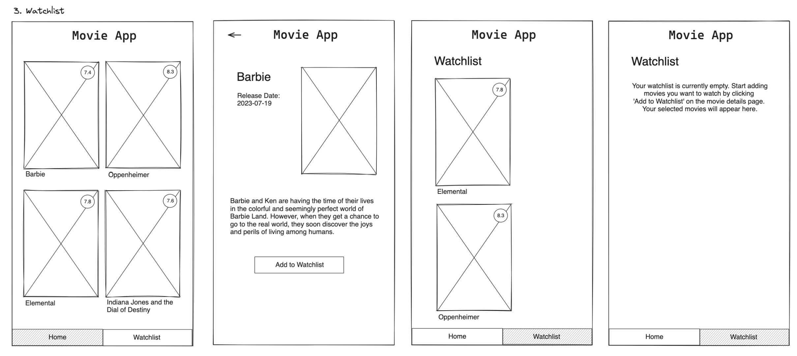

# Title

Watchlist!

## Value Proposition

As a `User`  
I want to `be able to add and remove movies to/from a Watchlist`  
so that `i can have a good overview of movies I still want to watch and easily acces them later`  

## Description

## Acceptance Criteria

- [] Button on movie detail page with toggle "Add to Watchlist" / "Remove from Watchlist"
  - [] Button functionality to add / remove a movie to / from the watchlist
- [] New Page with "Watchlist" as a Topic
- [] A Navbar to navigate between the Homepage and Watchlist
- [] A displayed message saying "Your watchlist is currently emtpy. Start adding movies you want to watch by clicking 'Add to Watchlist' on the movie detail page. Your selected movies will appear here."

## Tasks

- [] Add button on the movie detail page
  - [] introduce state to toggle between "Add to Watchlist" / "Remove from Watchlist"
- [] Create Watchlist page
  - [] add new file Watchlist.js for the Watchlist component
- [] Implement Watchlist functionaity
  - [] Create a state to manage the list of watchlist movies
  - [] Implement functionality to add movies to the watchlist
  - [] Implement functionality to remove movies from the watchlist
  - [] Ensure watchlist persists (locally or via API)
- [] Display message for an empty watchlist
